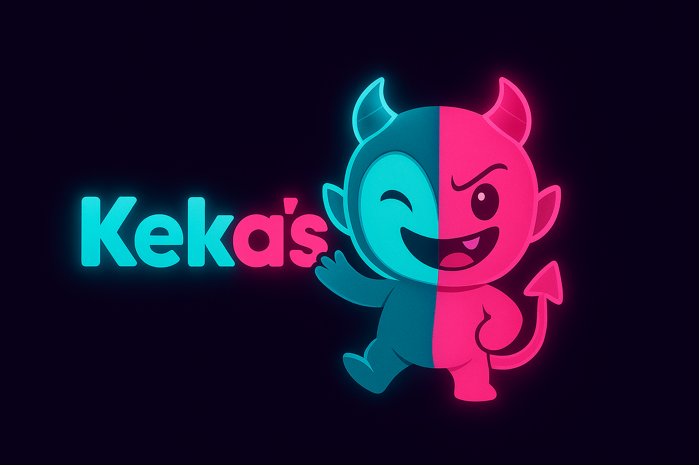

# Keka's - Jogo Verdade ou Desafio Online



Bem-vindo ao Keka's, um jogo multiplayer online de Verdade ou Desafio construído para ser uma experiência divertida e interativa entre amigos. Crie uma sala, convide seus amigos e deixe a garrafa decidir quem será o próximo a revelar um segredo ou a cumprir um desafio!

**[Clique aqui para jogar a versão ao vivo!](https://kekas.vercel.app)**

---

### 💡 Sobre o Projeto: A Jornada por Trás do Código

Este projeto representa mais do que apenas código; ele marca uma jornada pessoal de superação e um retorno à programação. Após um hiato de um ano afastado do desenvolvimento por motivos pessoais, o Keka's nasceu do desafio de reavaliar e reafirmar minhas habilidades técnicas, construindo uma aplicação complexa do zero e levando-a até o deploy de forma autônoma.

A escolha de criar um jogo foi intencional. Em vez de um projeto de estudo padrão, o objetivo era desenvolver uma aplicação que não apenas demonstrasse competência técnica, mas que também fosse genuinamente divertida e engajante para qualquer usuário. É uma forma de convidar todos — desde desenvolvedores a amigos — a testar e interagir com o resultado de um trabalho feito com muita dedicação.

Embora eu reconheça que a jornada de aprendizado e evolução é contínua, concluir este projeto me trouxe um imenso sentimento de realização e a certeza de que a paixão por criar e resolver problemas permanece intacta.

---

## 🚀 Funcionalidades

* **Salas Multiplayer:** Crie salas privadas e compartilhe o código de 4 dígitos para que seus amigos possam entrar.
* **Interação em Tempo Real:** Todas as ações, desde girar a garrafa até as votações, são sincronizadas em tempo real para todos os jogadores usando WebSockets.
* **Sistema de Jogo Dinâmico:** A lógica do jogo gerencia turnos, sorteia jogadores, apresenta cartas de verdade ou desafio e controla o fluxo de cada rodada.
* **Votação e Veredito:** Após um desafio ser cumprido, os outros jogadores podem votar se a performance foi boa ou não, e o "questioner" dá o veredito final.
* **Mecanismo de Suspensão:** Vereditos negativos podem resultar em suspensões temporárias para os jogadores, adicionando uma camada extra de estratégia.
* **Regra "Anti-Fuga":** Para manter o jogo justo, um jogador não pode escolher "Verdade" mais de duas vezes seguidas. Na terceira vez, a escolha será automaticamente "Desafio"!

---

## 🛠️ Tecnologias Utilizadas

Este projeto é um **monorepo full-stack** utilizando uma arquitetura moderna para separar as responsabilidades entre o cliente (frontend), o servidor (backend) e a infraestrutura.

#### **Linguagem Principal**
* **TypeScript:** Utilizado em todo o projeto para adicionar tipagem estática, garantindo um código mais seguro e manutenível.

#### **Frontend (Interface do Usuário)**
* **Framework:** React com Vite
* **Estilização:** Tailwind CSS
* **Comunicação em Tempo Real:** Socket.IO Client

#### **Backend (API)**
* **Framework:** Node.js com Express
* **Comunicação em Tempo Real:** Socket.IO
* **Banco de Dados:** PostgreSQL
* **ORM:** Sequelize

#### **Desenvolvimento & Deploy (DevOps)**
* **Ambiente Local:** Docker e Docker Compose
* **Hospedagem:** Frontend na Vercel, Backend e Banco de Dados no Render.
* **CI/CD:** Deploy contínuo configurado a partir de pushes na branch `main` do GitHub.

---

## ⚙️ Como Executar o Projeto Localmente

Para rodar este projeto no seu ambiente local, você precisará ter o **Docker** e o **Docker Compose** instalados.

1.  **Clone o repositório:**
    ```bash
    git clone [https://github.com/argemiroanjos/truth-or-dare_project.git](https://github.com/argemiroanjos/truth-or-dare_project.git)
    cd truth-or-dare_project
    ```

2.  **Crie o arquivo de ambiente para a API:**
    * Navegue até a pasta da API: `cd packages/api`
    * Crie um arquivo chamado `.env` com o seguinte conteúdo:
        ```env
        DATABASE_URL="postgresql://root:root@db:5432/spicy_db"
        PORT=3000
        CORS_ORIGIN="http://localhost:5173"
        ```
    * Volte para a pasta raiz: `cd ../..`

3.  **Inicie os contêineres:**
    A partir da raiz do projeto, execute o comando abaixo. Ele irá construir as imagens, iniciar todos os serviços e preparar o banco de dados automaticamente (rodando migrations e seeds).
    ```bash
    docker-compose up --build
    ```

4.  **Acesse a aplicação:**
    * Frontend estará disponível em: [**http://localhost:5173**](http://localhost:5173)

---

## 👨‍💻 Autor

* **Argemiro dos Anjos**
* **GitHub:** [@argemiroanjos](https://github.com/argemiroanjos)
* **LinkedIn:** [Argemiro dos Anjos](https://www.linkedin.com/in/argemiro-dos-anjos)